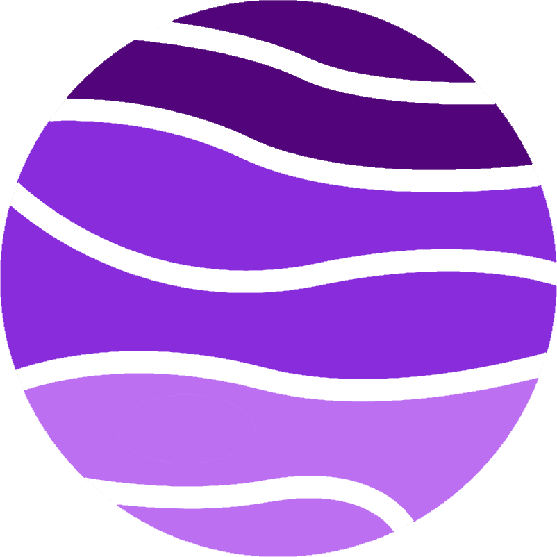

<div align="center">
  
</div>
<h1 align="center">
    reidfuhrman.com
</h1>

<p align="center">
  My personal portfolio website <a href="https://www.reidfuhrman.com">reidfuhrman.com</a>. Built with <a href="https://www.gatsbyjs.com/">Gatsby</a> and deployed by <a href="https://www.netlify.com/">Netlify</a>.
</p>

<p align="center">
  <a href="https://app.netlify.com/sites/brave-agnesi-3e8769/deploys" target="_blank">
    
  </a>
</p>


## Getting Started 🚀

These instructions will get you a copy of the project up and running on your local machine for development and testing purposes. See deployment for notes on how to deploy the project on a live system.

### Prerequisites 📋

You'll need [Git](https://git-scm.com) and [Node.js](https://nodejs.org/en/download/) (which comes with [NPM](http://npmjs.com)) installed on your computer.\
Also you need to have installed [Gatsby CLI](https://www.gatsbyjs.org/docs/quick-start/)

```
node@v10.16.0 or higher
npm@6.9.0 or higher
git@2.17.1 or higher
gatsby-cli@2.8.22 or higher
```

Also, you can use [Yarn](https://yarnpkg.com/) instead of NPM ☝️

```
yarn@v1.21.1 or higher
```

---

## How To Use 🔧

From your command line

```bash
# Clone this repository
$ git clone https://github.com/rjfuhrman42/portfolio-v2/

Then you can install the dependencies either using NPM or Yarn:

Using NPM:

```bash
# Install dependencies
$ npm install

# Start development server
$ npm run develop
```

Using Yarn:

```bash
# Install dependencies
$ yarn

# Start development server
$ yarn develop
```

**NOTE**:
If your run into issues installing the dependencies with NPM, use this command:

```bash
# Install dependencies with all permissions
$ sudo npm install --unsafe-perm=true --allow-root
```

Once your server has started, go to this url `http://localhost:8000/` and you will see the website running on a Development Server

---

## For Structure and Style help, refer to the <a href="https://github.com/cobidev/gatsby-simplefolio#instructions">Gatsby Simplefolio instructions </a>

---

## Technologies used 🛠️

- [Gatsby](https://www.gatsbyjs.org/) - Static Site Generator
- [GraphQL](https://graphql.org/) - Query language for APIs
- [React](https://es.reactjs.org/) - Front-End JavaScript library
- [Bootstrap 4](https://getbootstrap.com/docs/4.3/getting-started/introduction/) - Front-End UI library
- [Sass](https://sass-lang.com/documentation) - CSS extension language
